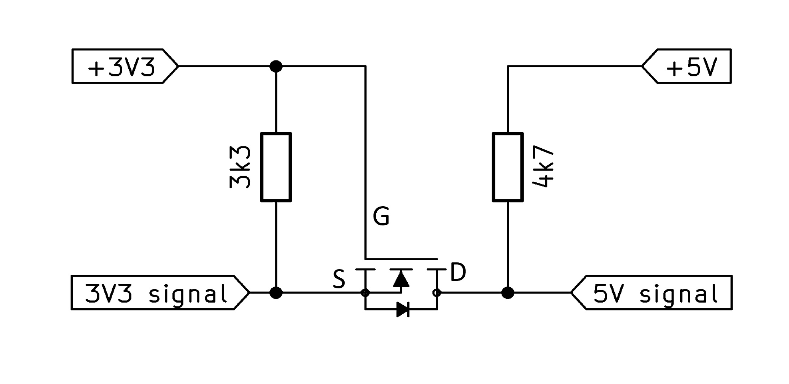

# How does a Bi-Directional Logic Level Shifter work? 

How does a Bi-Directional Logic Level Shifter work?  
It's a clever circuit that links 3.3V and 5V signals using just one small MOSFET transistor and two resistors.  
In the video link below I will explain how the circuit works, how to build it.  
Then we test the speed and show a real application with bi-directional communication.  
Finally, I will show one not so great version of the circuit often seen online and why I do not recommend to use that. 

### Watch the YouTube video with the full explanation:  
  

## Schematic:  

Recommended MOSFET type: BSS138.

